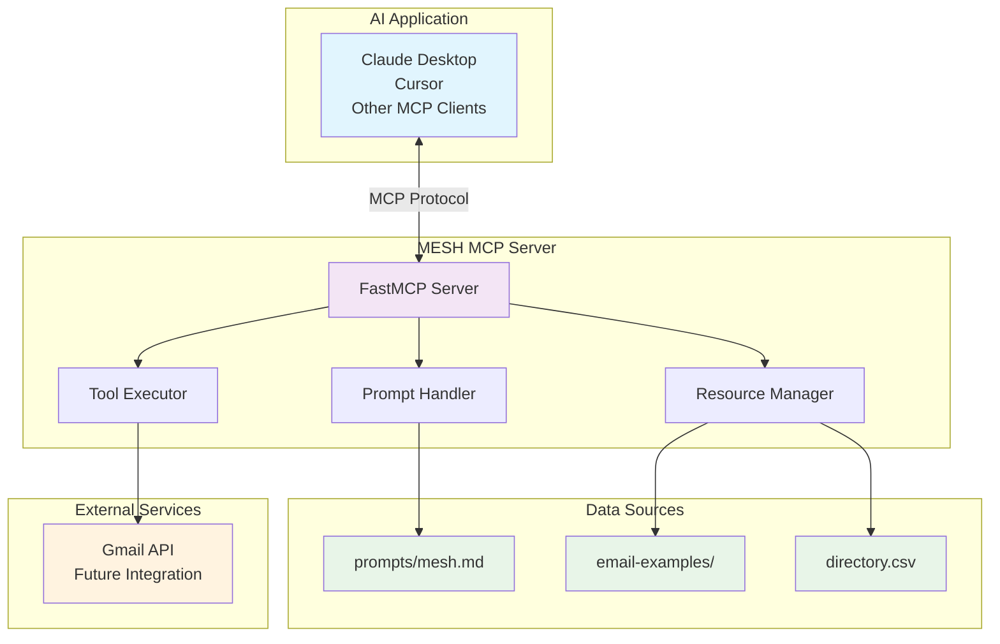

# MESH - Model Exchange Server Handler

> **A powerful Model Context Protocol (MCP) server that transforms any AI application into a sophisticated virtual assistant with email management, contact management, and professional networking capabilities.**

[](https://python.org)
[](https://modelcontextprotocol.io)
[](LICENSE)

## 🌟 Features

- **📧 Email Management**: Create professional email drafts with templates
- **👥 Contact Management**: Access and search through contact directories
- **📋 Template Suggestions**: AI-powered email template recommendations
- **🔧 MCP Integration**: Seamless integration with any MCP-compatible AI application
- **⚡ Fast & Reliable**: Built with FastMCP for optimal performance
- **🛡️ Error Handling**: Robust error handling and graceful degradation

## Quick Start

### Prerequisites

- Python 3.11 or higher
- [uv](https://github.com/astral-sh/uv) package manager

### Installation

1. **Install uv** (if not already installed):

```bash
# macOS/Linux
curl -LsSf https://astral.sh/uv/install.sh | sh

# Windows
powershell -ExecutionPolicy ByPass -c "irm https://astral.sh/uv/install.ps1 | iex"
```

2. **Clone the repository**:

```bash
git clone https://github.com/vishalm/mcp-demo.git
cd mcp-demo
```

3. **Install dependencies**:

```bash
uv sync
```

4. **Test the server**:

```bash
# Test server functions
uv run python test-mcp-functions.py

# Run server in development mode
uv run mcp dev mcp-server-test.py
```

## Configuration

### Adding MESH to Your AI Application

Add the following configuration to your AI application (e.g., Claude Desktop, Cursor):

```json
{
  "mcpServers": {
    "MESH": {
      "command": "/Users/vishal.mishra/.local/bin/uv",
      "args": [
        "--directory",
        "/Users/vishal.mishra/workspace/self/mcp-demo",
        "run",
        "--with", "mcp",
        "--with", "fastmcp",
        "python",
        "mcp-server-test.py"
      ]
    }
  }
}
```

**💡 Pro tip**: Run `python validate-config.py` to automatically generate the correct configuration for your system!

## 📚 Available Tools

### Prompts

| Function | Description |
|----------|-------------|
| `mesh(user_name, user_title)` | Global instructions for MESH assistant |

### 📖 Resources

| Resource | Description |
|----------|-------------|
| `email-examples://3-way-intro` | Professional 3-way introduction template |
| `email-examples://call-follow-up` | Call follow-up template with action items |
| `directory://all` | Complete contact directory |

### 🛠️ Tools

| Tool | Parameters | Description |
|------|------------|-------------|
| `write_email_draft` | `recipient_email`, `subject`, `body` | Create email drafts (test mode) |
| `get_contact_info` | `name` (optional) | Search and retrieve contact information |
| `suggest_email_template` | `context` | Get AI-powered email template suggestions |

## Architecture



## 📁 Project Structure

```
mcp-demo/
├── mcp-server-test.py          # Main MESH MCP server
├── test-mcp-functions.py       # Function testing script
├── prompts/
│   └── mesh.md                 # MESH assistant prompt template
├── email-examples/
│   ├── 3-way-intro.md          # 3-way introduction template
│   └── call-follow-up.md       # Call follow-up template
├── directory.csv               # Contact directory
├── pyproject.toml              # Project configuration
├── requirements.txt            # Dependencies
├── LICENSE                     # MIT License
└── README.md                   # This file
```

## 🖼️ MESH Server in Action

### MCP Inspector Interface

The MESH server can be tested and debugged using the MCP Inspector tool. Here are screenshots showing the server in action:

#### 1. Initial Connection Setup

*Configuring the MCP Inspector to connect to the MESH server via STDIO transport*

#### 2. Resources Management

*Viewing available resources including email templates and contact directory*

#### 3. Prompts Configuration

*Accessing the MESH assistant prompt template and global instructions*

#### 4. Tools and Functions

*Exploring available tools: email draft creation, contact management, and template suggestions*

#### 5. Server Status and Logs

*Monitoring server activity and connection status in real-time*


## Customization

### Personalizing MESH

1. **Update Personal Details**:
   - Edit `prompts/mesh.md` to customize:
     - Communication preferences
     - Task handling instructions
     - Professional guidelines
     - Personal assistant style

2. **Add Custom Templates**:
   - Create new email templates in `email-examples/`
   - Update the `suggest_email_template` function to include new contexts

3. **Extend Contact Directory**:
   - Add contacts to `directory.csv`
   - Ensure columns: `Name`, `Email`, `Url`, `Bio`

### Example Customization

```markdown
# prompts/mesh.md
You are MESH, a virtual assistant to {{user_name}} ({{user_title}}).

## Communication Style
- Professional yet friendly
- Concise but thorough
- Always include actionable next steps

## Special Instructions
- Prioritize email management tasks
- Suggest networking opportunities
- Maintain professional tone in all communications
```

## Testing

### Run Function Tests

```bash
uv run python test-mcp-functions.py
```

### Test Individual Components

```bash
# Test file reading
uv run python -c "from mcp_server_test import mesh; print(mesh('Test', 'Developer')[:100])"

# Test email draft creation
uv run python -c "from mcp_server_test import write_email_draft; print(write_email_draft('test@example.com', 'Test', 'Hello'))"
```

##  Usage Examples

### Creating an Email Draft

```python
# Using the write_email_draft tool
result = write_email_draft(
    recipient_email="colleague@company.com",
    subject="Follow-up on Project Discussion",
    body="Hi [Name],\n\nThank you for the productive discussion..."
)
```

### Searching Contacts

```python
# Get all contacts
all_contacts = get_contact_info()

# Search for specific contact
john_contacts = get_contact_info("John")
```

### Getting Template Suggestions

```python
# Get introduction template
intro_suggestion = suggest_email_template("introduction")

# Get follow-up template
followup_suggestion = suggest_email_template("follow-up")
```

##  Development

### Running in Development Mode

```bash
uv run mcp dev mcp-server-test.py
```

### Troubleshooting

If you encounter connection issues:

1. **Verify server startup**:
   ```bash
   python test-server-startup.py
   ```

2. **Check MCP configuration**:
   - Ensure the `command` path points to your uv installation
   - Verify the `--directory` path is correct
   - Make sure all required dependencies are installed

3. **Test server manually**:
   ```bash
   uv run --with mcp --with fastmcp python mcp-server-test.py
   ```

4. **Common issues**:
   - **"Not connected" error**: Usually means incorrect command/args in MCP config
   - **"Module not found"**: Run `uv sync` to install dependencies
   - **Permission issues**: Ensure uv is executable and paths are correct

```bash
uv run mcp dev mcp-server-test.py
```

### Adding New Tools

1. Add the tool function to `mcp-server-test.py`
2. Decorate with `@mcp.tool()`
3. Update this README with documentation
4. Add tests to `test-mcp-functions.py`

### Adding New Resources

1. Add the resource function to `mcp-server-test.py`
2. Decorate with `@mcp.resource("scheme://path")`
3. Update this README with documentation

## Contributing

1. Fork the repository
2. Create a feature branch (`git checkout -b feature/amazing-feature`)
3. Commit your changes (`git commit -m 'Add amazing feature'`)
4. Push to the branch (`git push origin feature/amazing-feature`)
5. Open a Pull Request

## 📄 License

This project is licensed under the MIT License - see the [LICENSE](LICENSE) file for details.

## Acknowledgments

- [Model Context Protocol](https://modelcontextprotocol.io) for the amazing protocol
- [FastMCP](https://github.com/jlowin/fastmcp) for the excellent server framework
- [uv](https://github.com/astral-sh/uv) for the fast Python package manager

## 📞 Support

- **Issues**: [GitHub Issues](https://github.com/vishalm/mcp-demo/issues)
- **Discussions**: [GitHub Discussions](https://github.com/vishalm/mcp-demo/discussions)


---

<div align="center">

**Mad by Vishal Mishra**

[](https://github.com/vishalm)
[](https://twitter.com/vishalm84)
[](https://www.linkedin.com/in/vishalkmishra/)

</div>
