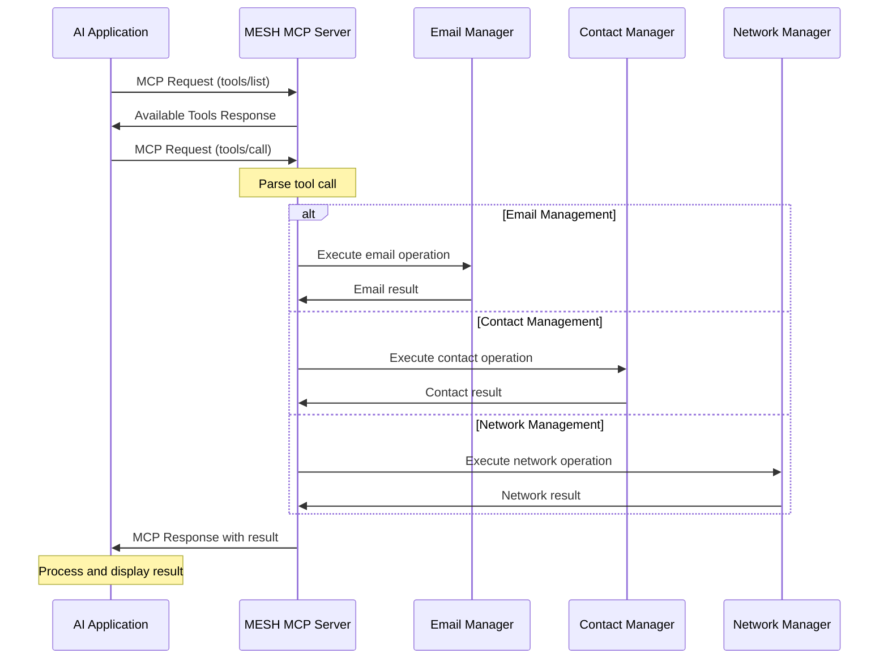
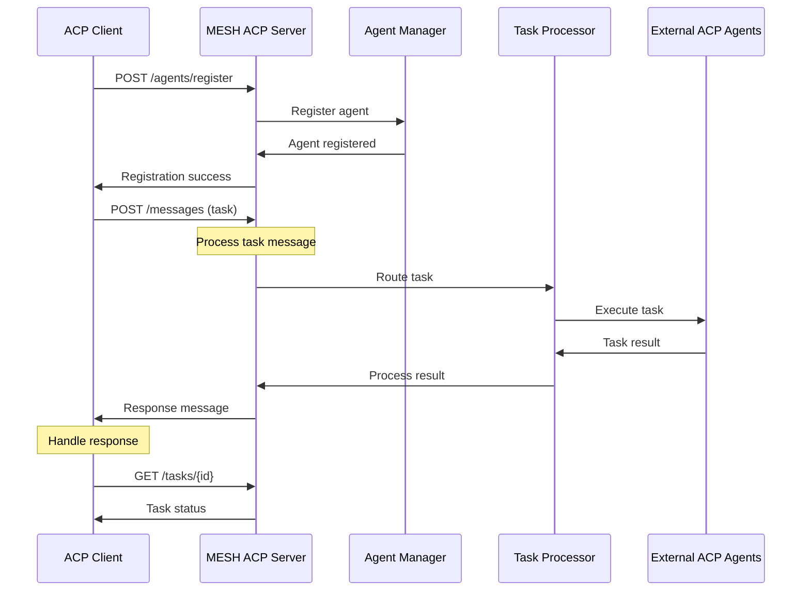
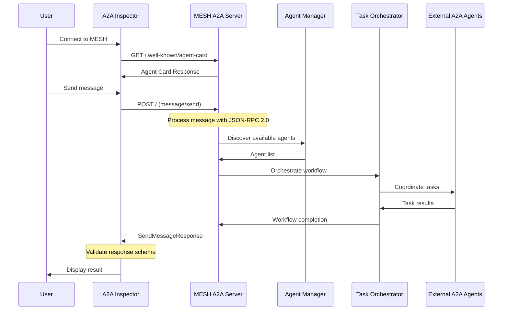
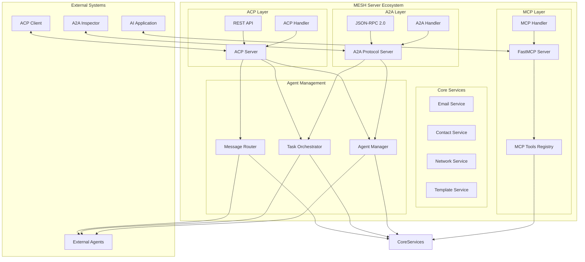
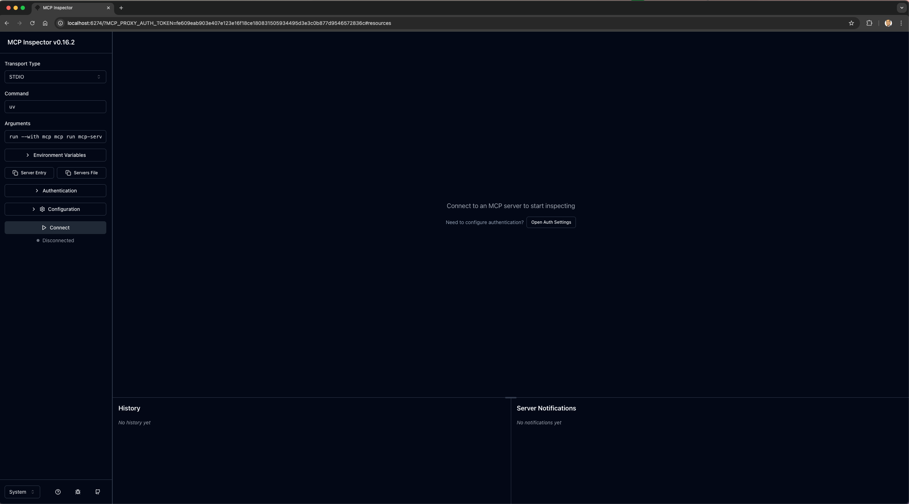
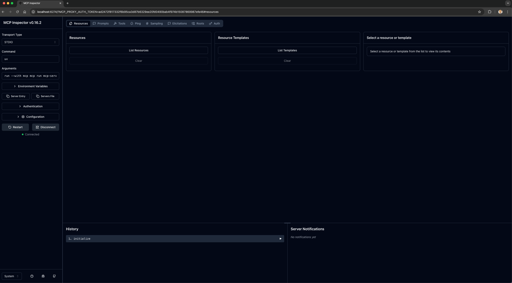
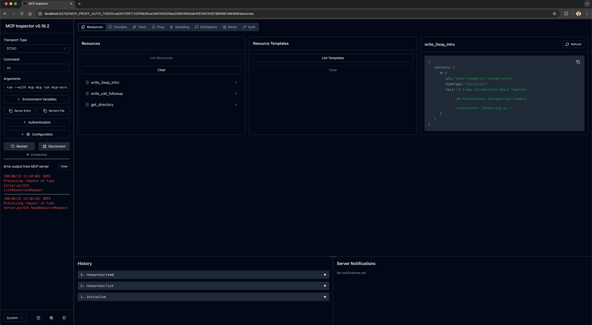
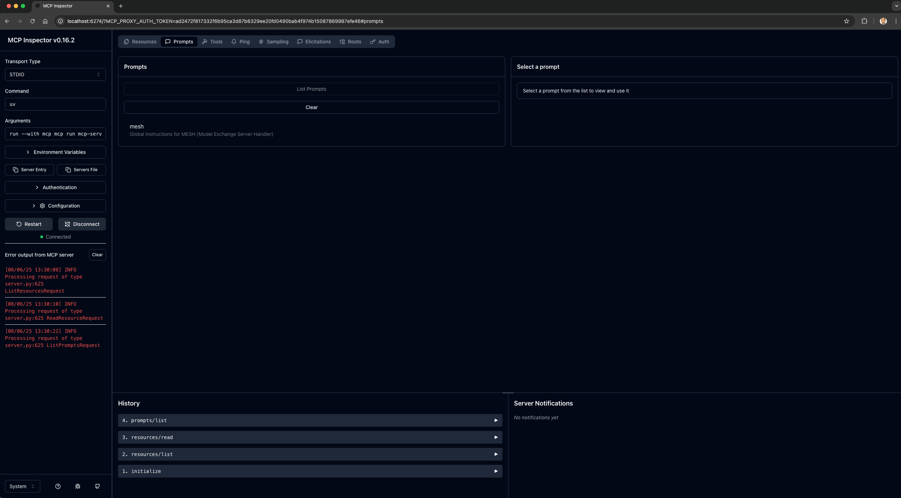
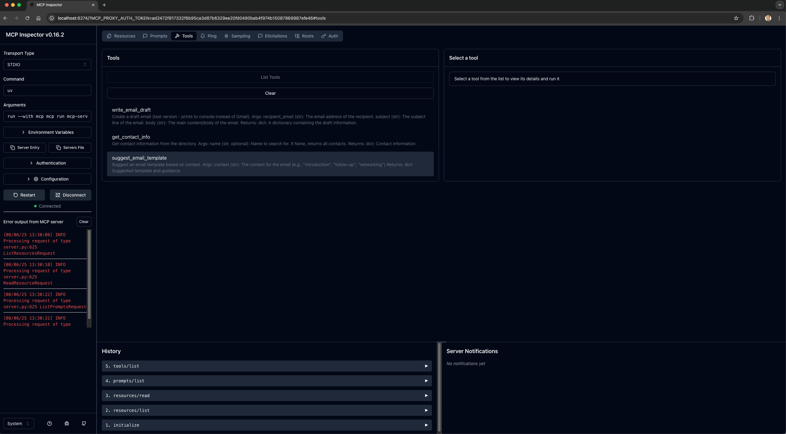

# MESH - Model Exchange Server Handler

> **A powerful Model Context Protocol (MCP) server that transforms any AI application into a sophisticated virtual assistant with email management, contact management, and professional networking capabilities.**

[](https://python.org)
[](https://modelcontextprotocol.io)
[](https://a2aprotocol.ai)
[](LICENSE)

## 🎯 Purpose & Vision

### **Why MESH Exists**
In today's AI landscape, applications often lack the tools needed for professional workflows. MESH bridges this gap by providing:

- **🔗 MCP Integration**: Seamless integration with any MCP-compatible AI application
- **📧 Professional Workflows**: Streamline email management and networking tasks
- **📋 Template Management**: AI-powered email template suggestions
- **👥 Contact Management**: Access and search through contact directories

### **The Problem We Solve**
- **Tool Limitations**: AI applications lack professional email and networking tools
- **Workflow Complexity**: Professional tasks require coordination across multiple systems
- **Template Management**: Creating professional emails from scratch is time-consuming
- **Contact Organization**: Managing professional relationships at scale is challenging

### **Our Solution**
MESH provides a comprehensive toolset that:
- ✅ **Enhances AI Applications**: Adds professional capabilities to any MCP client
- ✅ **Streamlines Workflows**: Automates email composition and contact management
- ✅ **Improves Productivity**: Provides ready-to-use templates and suggestions
- ✅ **Maintains Professional Standards**: Ensures consistent, high-quality communication

## 🚀 Quick Start

### Prerequisites
- Python 3.11 or higher
- uv package manager (recommended)

### Installation

#### Install uv (if not already installed):
```bash
# macOS/Linux
curl -LsSf https://astral.sh/uv/install.sh | sh

# Windows
powershell -ExecutionPolicy ByPass -c "irm https://astral.sh/uv/install.ps1 | iex"
```

#### Clone the repository:
```bash
git clone https://github.com/vishalm/agentic-protocol-demos.git
cd agentic-protocol-demos
```

#### Install dependencies:
```bash
uv sync
```

#### Test the server:
```bash
# Test server functions
uv run python test-mcp-functions.py

# Run server in development mode
uv run mcp dev mcp-server-test.py
```

### Configuration

#### Adding MESH to Your AI Application
Add the following configuration to your AI application (e.g., Claude Desktop, Cursor):

```json
{
  "mcpServers": {
    "MESH": {
      "command": "/Users/vishal.mishra/.local/bin/uv",
      "args": [
        "--directory",
        "/Users/vishal.mishra/workspace/self/agentic-protocol-demos",
        "run",
        "--with", "mcp",
        "--with", "fastmcp",
        "python",
        "mcp-server-test.py"
      ]
    }
  }
}
```

💡 **Pro tip**: Run `python validate-config.py` to automatically generate the correct configuration for your system!

## 🔧 Server Options

### Simple MCP Server (Recommended for Testing)
- **File**: `mcp-server-test.py`
- **Use Case**: Testing with MCP Inspector, basic MCP integration
- **Features**: Clean shutdown, no hanging issues, easy debugging
- **Command**: `python mcp-server-test.py`

### ACP Server (Agent Communication Protocol)
- **File**: `acp_server.py`
- **Use Case**: Multi-agent collaboration, standardized agent communication
- **Features**: RESTful API, agent discovery, task management, message routing
- **Command**: `python acp_server.py`
- **Port**: 8081 (http://127.0.0.1:8081)

### Hybrid Server (Advanced Usage)
- **File**: `hybrid_server.py`
- **Use Case**: Production deployment with both MCP and A2A protocols
- **Features**: Multi-protocol support, subprocess management
- **Command**: `python hybrid_server.py` (or use `./run.sh start`)

> **Note**: The simple MCP server is recommended for testing and development. Use the ACP server for multi-agent scenarios, and the hybrid server only when you need both MCP and A2A protocols.

## 🚀 Real-World Use Cases

### **1. Professional Email Management**
```
Scenario: A business professional needs to send follow-up emails after networking events
MESH Solution: 
- MCP client requests email composition
- MESH orchestrates with A2A email writing agent
- A2A tone analysis agent ensures appropriate messaging
- A2A grammar check agent validates content
Result: Professionally crafted, contextually appropriate emails
```

### **2. Strategic Networking Automation**
```
Scenario: Building and maintaining professional relationships at scale
MESH Solution:
- MCP client requests networking strategy
- MESH coordinates with A2A network analysis agent
- A2A opportunity identification agent finds prospects
- A2A calendar agent schedules follow-ups
Result: Automated networking pipeline with strategic follow-ups
```

### **3. Multi-Agent Customer Support**
```
Scenario: Complex customer inquiries requiring multiple specialized agents
MESH Solution:
- MCP client receives customer request
- MESH routes to appropriate A2A agents (technical, billing, product)
- Agents collaborate to provide comprehensive solution
- MESH aggregates responses into unified answer
Result: Seamless customer experience with expert-level support
```

### **4. Content Creation Workflow**
```
Scenario: Creating professional content requiring research, writing, and review
MESH Solution:
- MCP client requests content creation
- MESH coordinates research agent for information gathering
- Writing agent creates initial draft
- Review agent provides feedback and improvements
Result: High-quality, well-researched content delivered efficiently
```

## 🤖 ACP (Agent Communication Protocol) Integration

### **What is ACP?**
The [Agent Communication Protocol (ACP)](https://agentcommunicationprotocol.dev/) is an open protocol for agent interoperability that solves the growing challenge of connecting AI agents, applications, and humans. ACP enables agents to communicate through a standardized RESTful API that supports:

- **All forms of modality** - Text, images, audio, video, and custom formats
- **Synchronous and asynchronous communication** - Flexible interaction patterns
- **Streaming interactions** - Real-time communication capabilities
- **Both stateful and stateless operation** - Adaptable to different use cases
- **Online and offline agent discovery** - Robust agent management
- **Long running tasks** - Support for complex workflows

### **Why ACP with MESH?**
ACP addresses key challenges in modern AI systems:

- **Integration barriers** - Connect different agents without custom solutions
- **Duplicated effort** - Avoid rebuilding similar functionality
- **Scalability challenges** - Point-to-point integrations don't scale
- **Inconsistent developer experience** - Standardized patterns across frameworks

### **ACP Use Cases Enabled by MESH**

#### **1. Flexible Agent Replacement**
As AI technology rapidly evolves, the best-performing agent changes frequently. ACP compatibility lets you seamlessly swap agents in production systems, even when built with different frameworks.

```
Example: Upgrade your translation agent from a custom model to the latest LLM, 
or replace your code generation tool with a specialized coding assistant - 
all without modifying integration points.
```

#### **2. Multi-Agent Collaboration**
Build sophisticated systems where specialized agents work as coordinated teams.

```
Example: A content creation workflow might involve:
- Topic research agent gathering information
- Writing agent crafting the draft  
- SEO optimization agent refining for search performance
Each agent excels in their domain while seamlessly coordinating through standardized handoffs.
```

#### **3. Cross-Platform Integration**
Connect agents across your technology stack - marketing automation, analytics platforms, development tools, and communication systems.

```
Example: When your monitoring agent detects a performance issue, it can automatically:
- Trigger your incident response agent to create tickets
- Notify teams through communication agents
- Coordinate with deployment systems to roll back changes
```

#### **4. Inter-Company Partnerships**
Enable secure agent collaboration between organizations.

```
Example: A logistics company's routing agent could work with a supplier's inventory 
agent to optimize delivery schedules, or a marketing agency's campaign agent could 
coordinate with a client's approval workflow agent for streamlined content reviews.
```

### **ACP Server Features**

#### **Core Capabilities**
- **Agent Registration & Discovery** - Register and discover available agents
- **Task Management** - Send, monitor, and cancel tasks
- **Message Routing** - Route messages between agents
- **State Management** - Track task status and progress
- **Error Handling** - Comprehensive error reporting and recovery

#### **Supported Task Types**
- **Email Draft Creation** - Professional email composition
- **Contact Search** - Database querying and filtering
- **Template Suggestions** - AI-powered email templates
- **Custom Tasks** - Extensible for any agent capability

#### **API Endpoints**
- `GET /health` - Server health check
- `POST /agents/register` - Register new agents
- `GET /agents` - List all registered agents
- `POST /messages` - Send messages to agents
- `GET /tasks` - List and monitor tasks
- `DELETE /tasks/{id}` - Cancel running tasks

### **Getting Started with ACP**

#### **1. Start the ACP Server**
```bash
# Start the ACP server
python acp_server.py

# Server will be available at http://127.0.0.1:8081
# Interactive docs available at http://127.0.0.1:8081/docs
```

#### **2. Test ACP Functionality**
```bash
# Run ACP function tests
python test-acp-functions.py

# Test client-server communication
python acp_client.py
```

#### **3. Explore the API**
- **Health Check**: `curl http://127.0.0.1:8081/health`
- **List Agents**: `curl http://127.0.0.1:8081/agents`
- **API Documentation**: Visit http://127.0.0.1:8081/docs

#### **4. Register Your First Agent**
```python
import asyncio
from acp_client import ACPClient, EXAMPLE_AGENT_MANIFEST

async def register_agent():
    async with ACPClient() as client:
        result = await client.register_agent(EXAMPLE_AGENT_MANIFEST)
        print(f"Agent registered: {result}")

asyncio.run(register_agent())
```

### **ACP Architecture**

```
┌─────────────────┐    ┌─────────────────┐    ┌─────────────────┐
│   MCP Client    │    │   ACP Server    │    │   ACP Agents    │
│                 │    │                 │    │                 │
│ • Email Tools   │◄──►│ • Task Router   │◄──►│ • Email Agent   │
│ • Contact Mgmt  │    │ • Message Bus   │    │ • Contact Agent │
│ • Templates     │    │ • State Mgmt    │    │ • Template Agent│
└─────────────────┘    └─────────────────┘    └─────────────────┘
```

### **Integration with Existing MCP Tools**
ACP seamlessly integrates with your existing MCP tools:

- **MCP Tools** → **ACP Tasks**: Convert MCP tool calls to ACP task messages
- **MCP Resources** → **ACP Artifacts**: Share data and templates between protocols
- **MCP Prompts** → **ACP Agent Instructions**: Use MCP prompts to configure ACP agents

## 🚀 Real-World Use Cases

### **1. Professional Email Management**
```
Scenario: A business professional needs to send follow-up emails after networking events
MESH Solution: 
- MCP client requests email composition
- MESH orchestrates with A2A email writing agent
- A2A tone analysis agent ensures appropriate messaging
- A2A grammar check agent validates content
Result: Professionally crafted, contextually appropriate emails
```

### **2. Strategic Networking Automation**
```
Scenario: Building and maintaining professional relationships at scale
MESH Solution:
- MCP client requests networking strategy
- MESH coordinates with A2A network analysis agent
- A2A opportunity identification agent finds prospects
- A2A calendar agent schedules follow-ups
Result: Automated networking pipeline with strategic follow-ups
```

### **3. Multi-Agent Customer Support**
```
Scenario: Complex customer inquiries requiring multiple specialized agents
MESH Solution:
- MCP client receives customer request
- MESH routes to appropriate A2A agents (technical, billing, product)
- Agents collaborate to provide comprehensive solution
- MESH aggregates responses into unified answer
Result: Seamless customer experience with expert-level support
```

### **4. Content Creation Workflow**
```
Scenario: Creating professional content requiring research, writing, and review
MESH Solution:
- MCP client requests content creation
- MESH coordinates research agent for information gathering
- Writing agent creates initial draft
- Review agent provides feedback and improvements
Result: High-quality, well-researched content delivered efficiently
```

## 🔄 Communication Flow Diagrams

### MCP (Model Context Protocol) Communication Flow



### ACP (Agent Communication Protocol) Communication Flow



### A2A (Agent-to-Agent) Communication Flow



### MESH Complete Architecture (MCP + A2A + ACP)



### Protocol Integration & Data Flow

```mermaid
flowchart LR
    subgraph "Client Applications"
        MCPClient[MCP Client<br/>AI Applications]
        A2AClient[A2A Client<br/>Inspector Tools]
        ACPClient[ACP Client<br/>Agent Systems]
    end
    
    subgraph "MESH Protocol Layer"
        MCP[MCP Server<br/>STDIO Transport]
        A2A[A2A Server<br/>HTTP/WebSocket]
        ACP[ACP Server<br/>REST API]
    end
    
    subgraph "Shared Services"
        Email[Email Service]
        Contact[Contact Service]
        Template[Template Service]
        Agent[Agent Manager]
    end
    
    subgraph "Data Sources"
        Directory[Contact Directory]
        Templates[Email Templates]
        Prompts[System Prompts]
    end
    
    %% Client to Protocol connections
    MCPClient --> MCP
    A2AClient --> A2A
    ACPClient --> ACP
    
    %% Protocol to Services connections
    MCP --> Email
    MCP --> Contact
    MCP --> Template
    MCP --> Agent
    
    A2A --> Email
    A2A --> Contact
    A2A --> Template
    A2A --> Agent
    
    ACP --> Email
    ACP --> Contact
    ACP --> Template
    ACP --> Agent
    
    %% Services to Data connections
    Email --> Templates
    Contact --> Directory
    Template --> Templates
    Agent --> Prompts
    
    %% Cross-protocol communication
    MCP -.-> ACP
    A2A -.-> ACP
    ACP -.-> A2A
    
    style MCP fill:#e1f5fe
    style A2A fill:#f3e5f5
    style ACP fill:#e8f5e8
    style Email fill:#fff3e0
    style Contact fill:#fff3e0
    style Template fill:#fff3e0
    style Agent fill:#fff3e0

## 🏗️ Architecture Overview

### **Three-Protocol Architecture**

MESH now supports three complementary protocols that work together to provide comprehensive AI agent capabilities:

#### **1. MCP (Model Context Protocol)**
- **Purpose**: Direct AI application integration
- **Transport**: STDIO (standard input/output)
- **Use Case**: AI assistants, coding tools, desktop applications
- **Features**: Tool calling, resource access, prompt management

#### **2. A2A (Agent-to-Agent)**
- **Purpose**: Multi-agent collaboration and orchestration
- **Transport**: HTTP + WebSocket
- **Use Case**: Complex workflows, agent coordination, real-time communication
- **Features**: Agent discovery, message routing, workflow orchestration

#### **3. ACP (Agent Communication Protocol)**
- **Purpose**: Standardized agent interoperability
- **Transport**: RESTful HTTP API
- **Use Case**: Cross-platform integration, third-party agents, enterprise systems
- **Features**: Agent registration, task management, message history

```
### **How They Work Together**

```
┌─────────────────┐    ┌─────────────────┐    ┌─────────────────┐
│   MCP Client    │    │   A2A Client    │    │   ACP Client    │
│                 │    │                 │    │                 │
│ • Claude        │    │ • Inspector     │    │ • Agent System  │
│ • Cursor        │    │ • Web Tools     │    │ • Enterprise    │
│ • AI Apps       │    │ • Real-time     │    │ • Integration   │
└─────────────────┘    └─────────────────┘    └─────────────────┘
         │                       │                       │
         ▼                       ▼                       ▼
┌─────────────────────────────────────────────────────────────────┐
│                    MESH Server Ecosystem                        │
│                                                                 │
│  ┌─────────────┐  ┌─────────────┐  ┌─────────────┐            │
│  │ MCP Server  │  │ A2A Server  │  │ ACP Server  │            │
│  │ (STDIO)     │  │ (HTTP/WS)   │  │ (REST API)  │            │
│  └─────────────┘  └─────────────┘  └─────────────┘            │
│         │               │               │                      │
│         └───────────────┼───────────────┘                      │
│                         ▼                                      │
│  ┌─────────────────────────────────────────────────────────┐   │
│  │              Shared Core Services                       │   │
│  │  • Email Management  • Contact Management              │   │
│  │  • Template System   • Agent Management                │   │
│  │  • Task Orchestration • Message Routing                │   │
│  └─────────────────────────────────────────────────────────┘   │
└─────────────────────────────────────────────────────────────────┘
```

### **Protocol Benefits**

- **🔄 Interoperability**: Agents built for any protocol can work together
- **📈 Scalability**: Add new protocols without changing existing ones
- **🛠️ Flexibility**: Choose the right protocol for your use case
- **🔗 Integration**: Seamless communication between different systems
- **📊 Monitoring**: Unified view of all agent activities

## 🛠️ Prerequisites

- **Python 3.11+** - Modern Python with async support
- **[uv](https://github.com/astral-sh/uv)** - Fast Python package manager
- **Git** - For cloning the repository
- **Web Browser** - For accessing inspector tools

## 📦 Installation & Setup

### Step 1: Install uv Package Manager

```bash
# macOS/Linux
curl -LsSf https://astral.sh/uv/install.sh | sh

# Windows
powershell -ExecutionPolicy ByPass -c "irm https://astral.sh/uv/install.ps1 | iex"

# Verify installation
uv --version
```

### Step 2: Clone and Setup Project

```bash
# Clone the repository
git clone https://github.com/vishalm/agentic-protocol-demos.git
cd agentic-protocol-demos

# Install dependencies
uv sync

# Activate virtual environment
source .venv/bin/activate  # macOS/Linux
# .venv\Scripts\activate   # Windows
```

## 🚀 Quick Start Guide

### Option 1: One-Command Setup (Recommended)

```bash
# Start everything with one command
./run.sh start
```

This will:
- ✅ Check Python version and dependencies
- ✅ Install required packages
- ✅ Start both MCP and A2A servers
- ✅ Display connection information

### Option 2: Manual Setup

```bash
# Start hybrid server manually
python hybrid_server.py

# Or start individual servers
python a2a_server.py      # A2A server only
python mcp_server.py      # MCP server only
```

## 🔧 Configuration

### MCP Configuration

Create `mcp-config.json` in your AI application:

```json
{
  "mcpServers": {
    "MESH": {
      "command": "/path/to/uv",
      "args": [
        "--directory",
        "/path/to/agentic-protocol-demos",
        "run",
        "--with",
        "mcp",
        "--with",
        "fastmcp",
        "python",
        "hybrid_server.py"
      ]
    }
  }
}
```

### A2A Configuration

The A2A server automatically generates its agent card at `/.well-known/agent-card`:

```json
{
  "name": "mesh_agent",
  "description": "Professional email management and networking assistant with multi-agent collaboration capabilities.",
  "protocolVersion": "0.3.0",
  "preferredTransport": "JSONRPC",
  "capabilities": {
    "streaming": false
  },
  "skills": [
    {
      "id": "email_management",
      "name": "Email Composition & Management",
      "description": "Create professional emails and manage email templates"
    }
  ]
}
```

## 🧪 Testing & Debugging

### Project Status Check

```bash
# Check server status
./run.sh status

# Check specific components
./run.sh check-python
./run.sh check-deps
./run.sh check-structure
```

### Server Management

```bash
# Start servers
./run.sh start

# Stop servers
./run.sh stop

# Restart servers
./run.sh restart

# View logs
./run.sh logs
```

## 🔍 MCP Inspector Testing

### MCP Inspector Setup

The MCP Inspector helps debug MCP protocol communication and tool calls.

#### 1. Install MCP Inspector

```bash
# Install globally
pip install mcp-inspector

# Or use with uv
uv run mcp-inspector
```

#### 2. Configure MCP Inspector

When MCP Inspector launches:

1. **Select Transport**: Choose "STDIO" transport
2. **Set Command**: Enter `python mcp-server-test.py`
3. **Set Working Directory**: Navigate to your MESH project folder
4. **Connect**: Click "Connect" to establish connection

#### 3. Test MCP Tools

* List available tools
* Test individual tool calls
* Monitor tool execution
* Debug tool responses

### MCP Inspector in Action

The MCP Inspector provides a comprehensive interface for testing and debugging MCP protocol communication. Here are key screenshots showing the MCP Inspector working with MESH:

#### 1. Initial Connection Setup

MCP Inspector Setup _Configuring the MCP Inspector to connect to the MESH server via STDIO transport_

#### 2. Resources Management

MESH Resources _Viewing available resources including email templates and contact directory_

#### 3. Prompts Configuration

MESH Prompts _Accessing the MESH assistant prompt template and global instructions_

#### 4. Tools and Functions

MESH Tools _Exploring available tools: email draft creation, contact management, and template suggestions_

#### 5. Server Status and Logs

MESH Server Logs _Monitoring server activity and connection status in real-time_

### MCP Inspector Features

* **Tool Discovery**: Automatically lists all available MCP tools
* **Resource Management**: Browse and access MCP resources
* **Prompt Configuration**: Set up system prompts and instructions
* **Real-time Logging**: Monitor all MCP communication
* **Error Debugging**: Identify and fix protocol issues
* **Tool Testing**: Execute individual tool calls for validation

### Running MCP Inspector with MESH

#### 1. Start MESH Server First

```bash
# Test the server functions first
python test-mcp-functions.py

# Start the MCP server
python mcp-server-test.py
```

#### 2. Launch MCP Inspector

```bash
# Install and run MCP Inspector
pip install mcp-inspector
mcp-inspector

# Or use uv for faster installation
uv run mcp-inspector
```

#### 3. Configure MCP Inspector

When MCP Inspector launches:

1. **Select Transport**: Choose "STDIO" transport
2. **Set Command**: Enter `python mcp-server-test.py`
3. **Set Working Directory**: Navigate to your MESH project folder
4. **Connect**: Click "Connect" to establish connection

#### 4. Verify Connection

Successful connection will show:

* ✅ **MCP Server Connected**
* 📋 **Available Tools**: List of MCP functions
* 📚 **Resources**: Available data sources
* ⚙️ **Prompts**: System configuration templates

#### 5. Test MCP Tools

##### In MCP Inspector, you can now:
  - Browse available tools
  - Execute tool calls
  - View tool responses
  - Monitor server logs
  - Test resource access

#### 6. Stop MCP Inspector

* Close the MCP Inspector application
* Use `Ctrl+C` in the terminal running MESH server

## 🧪 Testing ACP Server

### **Quick Start Testing**

#### **1. Test ACP Functions**
```bash
# Run comprehensive ACP tests
python test-acp-functions.py

# Expected output: All 6 tests should pass
```

#### **2. Start ACP Server**
```bash
# Start the ACP server
python acp_server.py

# Server will be available at http://127.0.0.1:8081
# Interactive API docs at http://127.0.0.1:8081/docs
```

#### **3. Test Client-Server Communication**
```bash
# In a new terminal, run the ACP client demo
python acp_client.py

# This will demonstrate:
# - Agent registration
# - Task sending and processing
# - Message routing
# - Status monitoring
```

#### **4. Manual API Testing**
```bash
# Health check
curl http://127.0.0.1:8081/health

# List agents
curl http://127.0.0.1:8081/agents

# Send a test task
curl -X POST http://127.0.0.1:8081/messages \
  -H "Content-Type: application/json" \
  -d '{
    "type": "task",
    "sender": "test-client",
    "task_type": "email_draft",
    "parameters": {
      "recipient_email": "test@example.com",
      "subject": "Test Email",
      "body": "This is a test email."
    }
  }'
```

### **ACP Server Features Demonstrated**

#### **Agent Management**
- ✅ Agent registration and discovery
- ✅ Capability and task type specification
- ✅ Metadata and contact information

#### **Task Processing**
- ✅ Email draft creation
- ✅ Contact search and filtering
- ✅ Template suggestions
- ✅ Priority and timeout handling

#### **Message Routing**
- ✅ Task message handling
- ✅ Response message generation
- ✅ Error message creation
- ✅ Message history tracking

#### **State Management**
- ✅ Task status tracking (pending → running → completed/failed)
- ✅ Task cancellation support
- ✅ Comprehensive error handling

## 🔍 Inspector Tools Setup

### A2A Inspector Setup

The A2A Inspector is a web-based tool for testing and debugging A2A protocol communication.

#### 1. Access A2A Inspector
- Navigate to: `http://127.0.0.1:5001` (if running locally)
- Or use the online version: [A2A Inspector](https://a2aprotocol.ai/inspector)

#### 2. Connect to MESH
- Enter your MESH server URL: `http://127.0.0.1:8080`
- Click **Connect**
- Verify the agent card loads successfully

#### 3. Test Communication
- Use the chat interface to send messages
- Monitor the debug console for raw JSON-RPC communication
- Check validation results for protocol compliance


#### 4. Debug Console Features
- **Raw JSON View**: See exact protocol messages
- **Validation Results**: Check for protocol compliance
- **Error Details**: Identify and fix protocol issues
- **Real-time Logging**: Monitor all communication

### MCP Inspector Setup

The MCP Inspector helps debug MCP protocol communication and tool calls.

#### 1. Install MCP Inspector
```bash
# Install globally
pip install mcp-inspector

# Or use with uv
uv run mcp-inspector
```

#### 2. Configure MCP Inspector
```bash
# Create config file
mcp-inspector init

# Edit config to point to MESH
# Add your MESH server configuration
```

#### 3. Test MCP Tools
- List available tools
- Test individual tool calls
- Monitor tool execution
- Debug tool responses

### MCP Inspector in Action

The MCP Inspector provides a comprehensive interface for testing and debugging MCP protocol communication. Here are key screenshots showing the MCP Inspector working with MESH:

#### 1. Initial Connection Setup

*Configuring the MCP Inspector to connect to the MESH server via STDIO transport*

#### 2. Resources Management

*Viewing available resources including email templates and contact directory*

#### 3. Prompts Configuration

*Accessing the MESH assistant prompt template and global instructions*

#### 4. Tools and Functions

*Exploring available tools: email draft creation, contact management, and template suggestions*

#### 5. Server Status and Logs

*Monitoring server activity and connection status in real-time*

### MCP Inspector Features

- **Tool Discovery**: Automatically lists all available MCP tools
- **Resource Management**: Browse and access MCP resources
- **Prompt Configuration**: Set up system prompts and instructions
- **Real-time Logging**: Monitor all MCP communication
- **Error Debugging**: Identify and fix protocol issues
- **Tool Testing**: Execute individual tool calls for validation

### Running MCP Inspector with MESH

#### 1. Start MESH Server First
```bash
# Start the hybrid server (MCP + A2A)
./run.sh start

# Or start server only (no tests)
./run.sh start-only
```

#### 2. Verify MCP Server Status
```bash
# Check if servers are running
./run.sh status

# Expected output:
# ✅ MESH Hybrid Server is running
#   - MCP: STDIO transport (active)
#   - A2A: http://127.0.0.1:8080
```

#### 3. Launch MCP Inspector
```bash
# Install and run MCP Inspector
pip install mcp-inspector
mcp-inspector

# Or use uv for faster installation
uv run mcp-inspector
```

#### 4. Configure MCP Inspector
When MCP Inspector launches:

1. **Select Transport**: Choose "STDIO" transport
2. **Set Command**: Enter `python hybrid_server.py`
3. **Set Working Directory**: Navigate to your MESH project folder
4. **Connect**: Click "Connect" to establish connection

#### 5. Verify Connection
Successful connection will show:
- ✅ **MCP Server Connected**
- 📋 **Available Tools**: List of MCP functions
- 📚 **Resources**: Available data sources
- ⚙️ **Prompts**: System configuration templates

#### 6. Test MCP Tools
```bash
# In MCP Inspector, you can now:
# - Browse available tools
# - Execute tool calls
# - View tool responses
# - Monitor server logs
# - Test resource access
```

#### 7. Stop MCP Inspector
- Close the MCP Inspector application
- Use `Ctrl+C` in the terminal running MESH server
- Or run `./run.sh stop` to stop all servers

## 📊 Project Structure

```
agentic-protocol-demos/
├── mcp-server-test.py        # Main MESH MCP server
├── test-mcp-functions.py     # MCP function testing script
├── validate-config.py         # MCP configuration generator
├── acp_server.py             # ACP (Agent Communication Protocol) server
├── acp_client.py             # ACP client for testing and integration
├── test-acp-functions.py     # ACP function testing script
├── hybrid_server.py          # Hybrid server (MCP + A2A) - advanced usage
├── a2a_server.py            # A2A protocol server
├── agent_manager.py          # Agent discovery and management
├── task_orchestrator.py      # Workflow orchestration
├── a2a_config.py             # A2A configuration
├── agent_capabilities.py     # Agent skill definitions
├── run.sh                    # One-command setup and management
├── mcp-config.json           # MCP configuration example
├── pyproject.toml            # Project dependencies
├── requirements.txt           # Python requirements
├── prompts/                  # MESH assistant prompt templates
│   └── mesh.md               # Main prompt template
├── email-examples/           # Email template examples
│   ├── 3-way-intro.md        # 3-way introduction template
│   └── call-follow-up.md     # Call follow-up template
├── directory.csv             # Contact directory
└── resources/                # Documentation images
    ├── A2A-1.png            # A2A Inspector screenshot
    ├── A2A-2.png            # Chat interface screenshot
    └── A2A-3.png            # Debug console screenshot
```

## 🚨 Troubleshooting

### Common Issues

#### Port Already in Use
```bash
# Check what's using the port
lsof -i :8080

# Kill conflicting processes
./run.sh stop

# Or use different port
export A2A_PORT=8081
./run.sh start
```

#### A2A Inspector Connection Issues
- Verify MESH server is running: `./run.sh status`
- Check firewall settings
- Ensure correct port (8080 or 8081)
- Verify agent card endpoint: `curl http://127.0.0.1:8080/.well-known/agent-card`

#### MCP Integration Issues
- Verify MCP configuration path
- Check Python environment activation
- Ensure all dependencies are installed: `uv sync`
- Test with MCP Inspector tool

### Debug Mode

```bash
# Enable verbose logging
export LOG_LEVEL=DEBUG
./run.sh start

# View real-time logs
./run.sh logs

# Check server health
curl http://127.0.0.1:8080/health
```

## 🔗 API Reference

### A2A Endpoints

| Endpoint | Method | Description |
|----------|--------|-------------|
| `/` | POST | Main A2A protocol endpoint |
| `/.well-known/agent-card` | GET | Agent capabilities and skills |
| `/health` | GET | Server health check |
| `/ws` | WebSocket | Real-time communication |

### MCP Tools

| Tool | Description | Parameters |
|------|-------------|------------|
| `email_compose` | Create professional emails | `subject`, `recipient`, `template` |
| `contact_search` | Search contact database | `query`, `filters` |
| `network_analyze` | Analyze networking opportunities | `context`, `goals` |

## 🤝 Contributing

1. Fork the repository
2. Create a feature branch: `git checkout -b feature/amazing-feature`
3. Commit changes: `git commit -m 'Add amazing feature'`
4. Push to branch: `git push origin feature/amazing-feature`
5. Open a Pull Request

## 📄 License

This project is licensed under the MIT License - see the [LICENSE](LICENSE) file for details.

## 🙏 Acknowledgments

- **MCP Community**: For the Model Context Protocol specification
- **A2A Protocol**: For the Agent-to-Agent communication standards
- **FastAPI**: For the robust web framework
- **FastMCP**: For the efficient MCP implementation

## 📞 Support

- **Issues**: [GitHub Issues](https://github.com/vishalm/agentic-protocol-demos/issues)
- **Discussions**: [GitHub Discussions](https://github.com/vishalm/agentic-protocol-demos/discussions)
- **Documentation**: [Project Wiki](https://github.com/vishalm/agentic-protocol-demos/wiki)

---

**Ready to transform your AI applications with MESH? Start with `./run.sh start` and explore the future of AI collaboration! 🚀**
