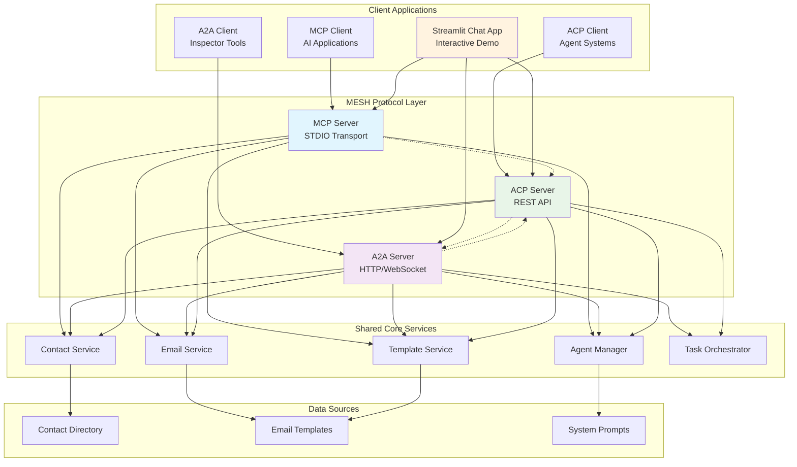

# MESH - Model Exchange Server Handler

> **A powerful multi-protocol server ecosystem that transforms any AI application into a sophisticated virtual assistant with email management, contact management, and professional networking capabilities.**

[](https://python.org)
[](https://modelcontextprotocol.io)
[](https://a2aprotocol.ai)
[](https://agentcommunicationprotocol.dev)
[](LICENSE)

## 🎯 Vision & Purpose

### **The Problem We Solve**
Modern AI applications lack the tools needed for professional workflows. MESH bridges this gap by providing:

- **🔗 Multi-Protocol Integration**: Seamless support for MCP, A2A, and ACP protocols
- **📧 Professional Workflows**: Streamline email management and networking tasks
- **🤖 Agent Orchestration**: Coordinate multiple AI agents for complex workflows
- **📋 Template Management**: AI-powered email template suggestions
- **👥 Contact Management**: Access and search through contact directories

### **Our Solution**
MESH provides a comprehensive ecosystem that:
- ✅ **Enhances AI Applications**: Adds professional capabilities to any protocol-compatible client
- ✅ **Streamlines Workflows**: Automates email composition and contact management
- ✅ **Improves Productivity**: Provides ready-to-use templates and suggestions
- ✅ **Maintains Professional Standards**: Ensures consistent, high-quality communication

## 🏗️ Architecture Overview



## 🚀 Quick Start

### **Option 1: Interactive Demo (Recommended)**
```bash
# Launch the interactive protocol showcase
./launch_chat_app.sh

# Features: Visual controls, real-time monitoring, interactive chat
```

### **Option 2: Server Management**
```bash
# Start all protocol servers
./run.sh start-all 

# Check status
./run.sh status
./run.sh setup      # Setup environment and install dependencies
./run.sh test       # Run tests only  
./run.sh start      # Start hybrid server (MCP + A2A)
./run.sh start-acp  # Start ACP server only
./run.sh start-all  # Start all servers
./run.sh stop       # Stop running servers
./run.sh restart    # Restart servers
./run.sh status     # Check server status
./run.sh help       # Show help message
```

### **Option 3: Individual Testing**

```bash
# Test MCP
python mcp/mcp-server-test.py

# Test A2A
python a2a/a2a_server.py

# Test ACP
python acp/acp_server.py
```

## Testing

```
# Test A2A server health
curl -s http://127.0.0.1:8080/health

# Test ACP server health  
curl -s http://127.0.0.1:8081/health

# Test A2A server root
curl -s http://127.0.0.1:8080/

# Test ACP server root
curl -s http://127.0.0.1:8081/

```

## 📁 Project Structure

```
agentic-protocol-demos/
├── 📁 mcp/                   # Model Context Protocol
│   ├── README.md             # MCP implementation details
│   ├── mcp-server-test.py    # Main MCP server
│   ├── test-mcp-functions.py # MCP testing
│   ├── validate-config.py    # Config generator
│   └── mcp-config.json      # MCP configuration
│
├── 📁 a2a/                   # Agent-to-Agent Protocol
│   ├── README.md             # A2A implementation details
│   ├── a2a_server.py        # A2A server
│   └── a2a_config.py        # A2A configuration
│
├── 📁 acp/                   # Agent Communication Protocol
│   ├── README.md             # ACP implementation details
│   ├── acp_server.py        # ACP server
│   ├── acp_client.py        # ACP client
│   └── test-acp-functions.py # ACP testing
│
├── 📁 shared/                # Shared Components
│   ├── README.md             # Shared components documentation
│   ├── agent_manager.py      # Agent management
│   ├── task_orchestrator.py  # Task orchestration
│   ├── agent_capabilities.py # Agent capabilities
│   └── hybrid_server.py      # Hybrid server
│
├── 📁 chat-app/              # Interactive Demo Application
│   ├── README.md             # Chat app documentation
│   ├── streamlit_app.py      # Streamlit application
│   ├── streamlit_requirements.txt # Dependencies
│   └── launch_streamlit.sh   # App launcher
│
├── 📁 prompts/               # System prompts
├── 📁 email-examples/        # Email templates
├── 📁 resources/             # Documentation images
│
├── 🎯 launch_chat_app.sh     # Root launcher for demo
├── 🛠️ run.sh                 # Server management
├── 📦 pyproject.toml         # Project dependencies
└── 📖 README.md              # This file
```

## 🔧 Prerequisites

- **Python 3.11+** - Modern Python with async support
- **[uv](https://github.com/astral-sh/uv)** - Fast Python package manager (recommended)
- **Git** - For cloning the repository

## 📦 Installation

```bash
# Clone the repository
git clone https://github.com/vishalm/agentic-protocol-demos.git
cd agentic-protocol-demos

# Install dependencies
uv sync

# Or with pip
pip install -r requirements.txt
```

## 🎯 Use Cases

### **1. Professional Email Management**
- AI-powered email composition
- Template suggestions and management
- Contact integration and validation

### **2. Multi-Agent Workflows**
- Agent discovery and coordination
- Task delegation and orchestration
- Cross-protocol communication

### **3. Enterprise Integration**
- Standardized agent communication
- RESTful API for external systems
- Scalable agent management

## 🔍 Testing & Validation

```bash
# Basic functionality test
python test_basic_functionality.py

# Structure validation
python demo_organized_structure.py
```

## 📚 Detailed Documentation

For detailed information about each component:

- **[MCP Protocol](mcp/README.md)** - Model Context Protocol implementation
- **[A2A Protocol](a2a/README.md)** - Agent-to-Agent communication
- **[ACP Protocol](acp/README.md)** - Agent Communication Protocol
- **[Shared Components](shared/README.md)** - Common functionality
- **[Chat Application](chat-app/README.md)** - Interactive demo interface

## 🚨 Troubleshooting

### **Quick Fixes**
```bash
# Check server status
./run.sh status

# View logs
./run.sh logs

# Restart servers
./run.sh restart
```

### **Common Issues**
- **Port conflicts**: Use `./run.sh stop` then `./run.sh start`
- **Import errors**: Ensure dependencies with `uv sync`
- **Streamlit issues**: Check `chat-app/README.md`

## 🤝 Contributing

1. Fork the repository
2. Create a feature branch: `git checkout -b feature/amazing-feature`
3. Commit changes: `git commit -m 'Add amazing feature'`
4. Push to branch: `git push origin feature/amazing-feature`
5. Open a Pull Request

## 📄 License

This project is licensed under the MIT License - see the [LICENSE](LICENSE) file for details.

## 🙏 Acknowledgments

- **MCP Community**: For the Model Context Protocol specification
- **A2A Protocol**: For the Agent-to-Agent communication standards
- **ACP Protocol**: For the Agent Communication Protocol
- **FastAPI**: For the robust web framework
- **FastMCP**: For the efficient MCP implementation

---

**Ready to transform your AI applications with MESH? Start with `./launch_chat_app.sh` and explore the future of AI collaboration! 🚀**
