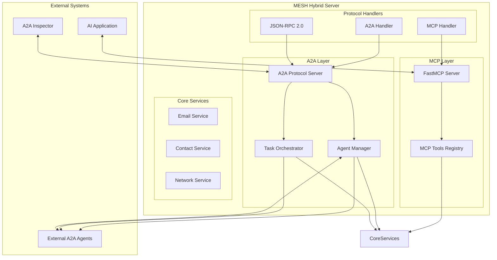
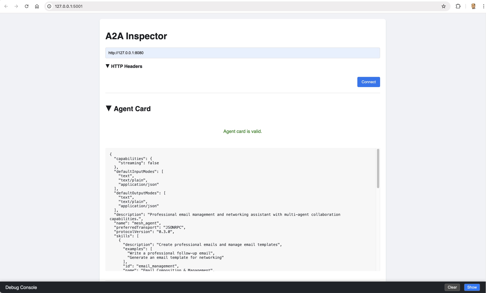

# MESH - Model Exchange Server Handler

> **A powerful Model Context Protocol (MCP) server that transforms any AI application into a sophisticated virtual assistant with email management, contact management, and professional networking capabilities.**

[](https://python.org)
[](https://modelcontextprotocol.io)
[](https://a2aprotocol.ai)
[](LICENSE)

## 🎯 Purpose & Vision

### **Why MESH Exists**
In today's AI landscape, applications often lack the tools needed for professional workflows. MESH bridges this gap by providing:

- **🔗 MCP Integration**: Seamless integration with any MCP-compatible AI application
- **📧 Professional Workflows**: Streamline email management and networking tasks
- **📋 Template Management**: AI-powered email template suggestions
- **👥 Contact Management**: Access and search through contact directories

### **The Problem We Solve**
- **Tool Limitations**: AI applications lack professional email and networking tools
- **Workflow Complexity**: Professional tasks require coordination across multiple systems
- **Template Management**: Creating professional emails from scratch is time-consuming
- **Contact Organization**: Managing professional relationships at scale is challenging

### **Our Solution**
MESH provides a comprehensive toolset that:
- ✅ **Enhances AI Applications**: Adds professional capabilities to any MCP client
- ✅ **Streamlines Workflows**: Automates email composition and contact management
- ✅ **Improves Productivity**: Provides ready-to-use templates and suggestions
- ✅ **Maintains Professional Standards**: Ensures consistent, high-quality communication

## 🚀 Quick Start

### Prerequisites
- Python 3.11 or higher
- uv package manager (recommended)

### Installation

#### Install uv (if not already installed):
```bash
# macOS/Linux
curl -LsSf https://astral.sh/uv/install.sh | sh

# Windows
powershell -ExecutionPolicy ByPass -c "irm https://astral.sh/uv/install.ps1 | iex"
```

#### Clone the repository:
```bash
git clone https://github.com/vishalm/agentic-protocol-demos.git
cd agentic-protocol-demos
```

#### Install dependencies:
```bash
uv sync
```

#### Test the server:
```bash
# Test server functions
uv run python test-mcp-functions.py

# Run server in development mode
uv run mcp dev mcp-server-test.py
```

### Configuration

#### Adding MESH to Your AI Application
Add the following configuration to your AI application (e.g., Claude Desktop, Cursor):

```json
{
  "mcpServers": {
    "MESH": {
      "command": "/Users/vishal.mishra/.local/bin/uv",
      "args": [
        "--directory",
        "/Users/vishal.mishra/workspace/self/agentic-protocol-demos",
        "run",
        "--with", "mcp",
        "--with", "fastmcp",
        "python",
        "mcp-server-test.py"
      ]
    }
  }
}
```

💡 **Pro tip**: Run `python validate-config.py` to automatically generate the correct configuration for your system!

## 🔧 Server Options

### Simple MCP Server (Recommended for Testing)
- **File**: `mcp-server-test.py`
- **Use Case**: Testing with MCP Inspector, basic MCP integration
- **Features**: Clean shutdown, no hanging issues, easy debugging
- **Command**: `python mcp-server-test.py`

### Hybrid Server (Advanced Usage)
- **File**: `hybrid_server.py`
- **Use Case**: Production deployment with both MCP and A2A protocols
- **Features**: Multi-protocol support, subprocess management
- **Command**: `python hybrid_server.py` (or use `./run.sh start`)

> **Note**: The simple MCP server is recommended for testing and development. Use the hybrid server only when you need both MCP and A2A protocols.

## 🚀 Real-World Use Cases

### **1. Professional Email Management**
```
Scenario: A business professional needs to send follow-up emails after networking events
MESH Solution: 
- MCP client requests email composition
- MESH orchestrates with A2A email writing agent
- A2A tone analysis agent ensures appropriate messaging
- A2A grammar check agent validates content
Result: Professionally crafted, contextually appropriate emails
```

### **2. Strategic Networking Automation**
```
Scenario: Building and maintaining professional relationships at scale
MESH Solution:
- MCP client requests networking strategy
- MESH coordinates with A2A network analysis agent
- A2A opportunity identification agent finds prospects
- A2A calendar agent schedules follow-ups
Result: Automated networking pipeline with strategic follow-ups
```

### **3. Multi-Agent Customer Support**
```
Scenario: Complex customer inquiries requiring multiple specialized agents
MESH Solution:
- MCP client receives customer request
- MESH routes to appropriate A2A agents (technical, billing, product)
- Agents collaborate to provide comprehensive solution
- MESH aggregates responses into unified answer
Result: Seamless customer experience with expert-level support
```

### **4. Content Creation Workflow**
```
Scenario: Creating professional content requiring research, writing, and review
MESH Solution:
- MCP client requests content creation
- MESH coordinates research agent for information gathering
- Writing agent creates initial draft
- Review agent provides feedback and improvements
Result: High-quality, well-researched content delivered efficiently
```

## 🔄 Communication Flow Diagrams

### MCP (Model Context Protocol) Communication Flow


### A2A (Agent-to-Agent) Communication Flow


### Hybrid Server Architecture



## 🛠️ Prerequisites

- **Python 3.11+** - Modern Python with async support
- **[uv](https://github.com/astral-sh/uv)** - Fast Python package manager
- **Git** - For cloning the repository
- **Web Browser** - For accessing inspector tools

## 📦 Installation & Setup

### Step 1: Install uv Package Manager

```bash
# macOS/Linux
curl -LsSf https://astral.sh/uv/install.sh | sh

# Windows
powershell -ExecutionPolicy ByPass -c "irm https://astral.sh/uv/install.ps1 | iex"

# Verify installation
uv --version
```

### Step 2: Clone and Setup Project

```bash
# Clone the repository
git clone https://github.com/vishalm/agentic-protocol-demos.git
cd agentic-protocol-demos

# Install dependencies
uv sync

# Activate virtual environment
source .venv/bin/activate  # macOS/Linux
# .venv\Scripts\activate   # Windows
```

## 🚀 Quick Start Guide

### Option 1: One-Command Setup (Recommended)

```bash
# Start everything with one command
./run.sh start
```

This will:
- ✅ Check Python version and dependencies
- ✅ Install required packages
- ✅ Start both MCP and A2A servers
- ✅ Display connection information

### Option 2: Manual Setup

```bash
# Start hybrid server manually
python hybrid_server.py

# Or start individual servers
python a2a_server.py      # A2A server only
python mcp_server.py      # MCP server only
```

## 🔧 Configuration

### MCP Configuration

Create `mcp-config.json` in your AI application:

```json
{
  "mcpServers": {
    "MESH": {
      "command": "/path/to/uv",
      "args": [
        "--directory",
        "/path/to/agentic-protocol-demos",
        "run",
        "--with",
        "mcp",
        "--with",
        "fastmcp",
        "python",
        "hybrid_server.py"
      ]
    }
  }
}
```

### A2A Configuration

The A2A server automatically generates its agent card at `/.well-known/agent-card`:

```json
{
  "name": "mesh_agent",
  "description": "Professional email management and networking assistant with multi-agent collaboration capabilities.",
  "protocolVersion": "0.3.0",
  "preferredTransport": "JSONRPC",
  "capabilities": {
    "streaming": false
  },
  "skills": [
    {
      "id": "email_management",
      "name": "Email Composition & Management",
      "description": "Create professional emails and manage email templates"
    }
  ]
}
```

## 🧪 Testing & Debugging

### Project Status Check

```bash
# Check server status
./run.sh status

# Check specific components
./run.sh check-python
./run.sh check-deps
./run.sh check-structure
```

### Server Management

```bash
# Start servers
./run.sh start

# Stop servers
./run.sh stop

# Restart servers
./run.sh restart

# View logs
./run.sh logs
```

## 🔍 MCP Inspector Testing

### MCP Inspector Setup

The MCP Inspector helps debug MCP protocol communication and tool calls.

#### 1. Install MCP Inspector

```bash
# Install globally
pip install mcp-inspector

# Or use with uv
uv run mcp-inspector
```

#### 2. Configure MCP Inspector

When MCP Inspector launches:

1. **Select Transport**: Choose "STDIO" transport
2. **Set Command**: Enter `python mcp-server-test.py`
3. **Set Working Directory**: Navigate to your MESH project folder
4. **Connect**: Click "Connect" to establish connection

#### 3. Test MCP Tools

* List available tools
* Test individual tool calls
* Monitor tool execution
* Debug tool responses

### MCP Inspector in Action

The MCP Inspector provides a comprehensive interface for testing and debugging MCP protocol communication. Here are key screenshots showing the MCP Inspector working with MESH:

#### 1. Initial Connection Setup

MCP Inspector Setup _Configuring the MCP Inspector to connect to the MESH server via STDIO transport_

#### 2. Resources Management

MESH Resources _Viewing available resources including email templates and contact directory_

#### 3. Prompts Configuration

MESH Prompts _Accessing the MESH assistant prompt template and global instructions_

#### 4. Tools and Functions

MESH Tools _Exploring available tools: email draft creation, contact management, and template suggestions_

#### 5. Server Status and Logs

MESH Server Logs _Monitoring server activity and connection status in real-time_

### MCP Inspector Features

* **Tool Discovery**: Automatically lists all available MCP tools
* **Resource Management**: Browse and access MCP resources
* **Prompt Configuration**: Set up system prompts and instructions
* **Real-time Logging**: Monitor all MCP communication
* **Error Debugging**: Identify and fix protocol issues
* **Tool Testing**: Execute individual tool calls for validation

### Running MCP Inspector with MESH

#### 1. Start MESH Server First

```bash
# Test the server functions first
python test-mcp-functions.py

# Start the MCP server
python mcp-server-test.py
```

#### 2. Launch MCP Inspector

```bash
# Install and run MCP Inspector
pip install mcp-inspector
mcp-inspector

# Or use uv for faster installation
uv run mcp-inspector
```

#### 3. Configure MCP Inspector

When MCP Inspector launches:

1. **Select Transport**: Choose "STDIO" transport
2. **Set Command**: Enter `python mcp-server-test.py`
3. **Set Working Directory**: Navigate to your MESH project folder
4. **Connect**: Click "Connect" to establish connection

#### 4. Verify Connection

Successful connection will show:

* ✅ **MCP Server Connected**
* 📋 **Available Tools**: List of MCP functions
* 📚 **Resources**: Available data sources
* ⚙️ **Prompts**: System configuration templates

#### 5. Test MCP Tools

##### In MCP Inspector, you can now:
  - Browse available tools
  - Execute tool calls
  - View tool responses
  - Monitor server logs
  - Test resource access

#### 6. Stop MCP Inspector

* Close the MCP Inspector application
* Use `Ctrl+C` in the terminal running MESH server

## 🔍 Inspector Tools Setup

### A2A Inspector Setup

The A2A Inspector is a web-based tool for testing and debugging A2A protocol communication.

#### 1. Access A2A Inspector
- Navigate to: `http://127.0.0.1:5001` (if running locally)
- Or use the online version: [A2A Inspector](https://a2aprotocol.ai/inspector)

#### 2. Connect to MESH
- Enter your MESH server URL: `http://127.0.0.1:8080`
- Click **Connect**
- Verify the agent card loads successfully

#### 3. Test Communication
- Use the chat interface to send messages
- Monitor the debug console for raw JSON-RPC communication
- Check validation results for protocol compliance



#### 4. Debug Console Features
- **Raw JSON View**: See exact protocol messages
- **Validation Results**: Check for protocol compliance
- **Error Details**: Identify and fix protocol issues
- **Real-time Logging**: Monitor all communication

### MCP Inspector Setup

The MCP Inspector helps debug MCP protocol communication and tool calls.

#### 1. Install MCP Inspector
```bash
# Install globally
pip install mcp-inspector

# Or use with uv
uv run mcp-inspector
```

#### 2. Configure MCP Inspector
```bash
# Create config file
mcp-inspector init

# Edit config to point to MESH
# Add your MESH server configuration
```

#### 3. Test MCP Tools
- List available tools
- Test individual tool calls
- Monitor tool execution
- Debug tool responses

### MCP Inspector in Action

The MCP Inspector provides a comprehensive interface for testing and debugging MCP protocol communication. Here are key screenshots showing the MCP Inspector working with MESH:

#### 1. Initial Connection Setup

*Configuring the MCP Inspector to connect to the MESH server via STDIO transport*

#### 2. Resources Management

*Viewing available resources including email templates and contact directory*

#### 3. Prompts Configuration

*Accessing the MESH assistant prompt template and global instructions*

#### 4. Tools and Functions

*Exploring available tools: email draft creation, contact management, and template suggestions*

#### 5. Server Status and Logs

*Monitoring server activity and connection status in real-time*

### MCP Inspector Features

- **Tool Discovery**: Automatically lists all available MCP tools
- **Resource Management**: Browse and access MCP resources
- **Prompt Configuration**: Set up system prompts and instructions
- **Real-time Logging**: Monitor all MCP communication
- **Error Debugging**: Identify and fix protocol issues
- **Tool Testing**: Execute individual tool calls for validation

### Running MCP Inspector with MESH

#### 1. Start MESH Server First
```bash
# Start the hybrid server (MCP + A2A)
./run.sh start

# Or start server only (no tests)
./run.sh start-only
```

#### 2. Verify MCP Server Status
```bash
# Check if servers are running
./run.sh status

# Expected output:
# ✅ MESH Hybrid Server is running
#   - MCP: STDIO transport (active)
#   - A2A: http://127.0.0.1:8080
```

#### 3. Launch MCP Inspector
```bash
# Install and run MCP Inspector
pip install mcp-inspector
mcp-inspector

# Or use uv for faster installation
uv run mcp-inspector
```

#### 4. Configure MCP Inspector
When MCP Inspector launches:

1. **Select Transport**: Choose "STDIO" transport
2. **Set Command**: Enter `python hybrid_server.py`
3. **Set Working Directory**: Navigate to your MESH project folder
4. **Connect**: Click "Connect" to establish connection

#### 5. Verify Connection
Successful connection will show:
- ✅ **MCP Server Connected**
- 📋 **Available Tools**: List of MCP functions
- 📚 **Resources**: Available data sources
- ⚙️ **Prompts**: System configuration templates

#### 6. Test MCP Tools
```bash
# In MCP Inspector, you can now:
# - Browse available tools
# - Execute tool calls
# - View tool responses
# - Monitor server logs
# - Test resource access
```

#### 7. Stop MCP Inspector
- Close the MCP Inspector application
- Use `Ctrl+C` in the terminal running MESH server
- Or run `./run.sh stop` to stop all servers

## 📊 Project Structure

```
agentic-protocol-demos/
├── mcp-server-test.py        # Main MESH MCP server
├── test-mcp-functions.py     # Function testing script
├── validate-config.py         # MCP configuration generator
├── hybrid_server.py          # Hybrid server (MCP + A2A) - advanced usage
├── a2a_server.py            # A2A protocol server
├── agent_manager.py          # Agent discovery and management
├── task_orchestrator.py      # Workflow orchestration
├── a2a_config.py             # A2A configuration
├── agent_capabilities.py     # Agent skill definitions
├── run.sh                    # One-command setup and management
├── mcp-config.json           # MCP configuration example
├── pyproject.toml            # Project dependencies
├── requirements.txt           # Python requirements
├── prompts/                  # MESH assistant prompt templates
│   └── mesh.md               # Main prompt template
├── email-examples/           # Email template examples
│   ├── 3-way-intro.md        # 3-way introduction template
│   └── call-follow-up.md     # Call follow-up template
├── directory.csv             # Contact directory
└── resources/                # Documentation images
    ├── A2A-1.png            # A2A Inspector screenshot
    ├── A2A-2.png            # Chat interface screenshot
    └── A2A-3.png            # Debug console screenshot
```

## 🚨 Troubleshooting

### Common Issues

#### Port Already in Use
```bash
# Check what's using the port
lsof -i :8080

# Kill conflicting processes
./run.sh stop

# Or use different port
export A2A_PORT=8081
./run.sh start
```

#### A2A Inspector Connection Issues
- Verify MESH server is running: `./run.sh status`
- Check firewall settings
- Ensure correct port (8080 or 8081)
- Verify agent card endpoint: `curl http://127.0.0.1:8080/.well-known/agent-card`

#### MCP Integration Issues
- Verify MCP configuration path
- Check Python environment activation
- Ensure all dependencies are installed: `uv sync`
- Test with MCP Inspector tool

### Debug Mode

```bash
# Enable verbose logging
export LOG_LEVEL=DEBUG
./run.sh start

# View real-time logs
./run.sh logs

# Check server health
curl http://127.0.0.1:8080/health
```

## 🔗 API Reference

### A2A Endpoints

| Endpoint | Method | Description |
|----------|--------|-------------|
| `/` | POST | Main A2A protocol endpoint |
| `/.well-known/agent-card` | GET | Agent capabilities and skills |
| `/health` | GET | Server health check |
| `/ws` | WebSocket | Real-time communication |

### MCP Tools

| Tool | Description | Parameters |
|------|-------------|------------|
| `email_compose` | Create professional emails | `subject`, `recipient`, `template` |
| `contact_search` | Search contact database | `query`, `filters` |
| `network_analyze` | Analyze networking opportunities | `context`, `goals` |

## 🤝 Contributing

1. Fork the repository
2. Create a feature branch: `git checkout -b feature/amazing-feature`
3. Commit changes: `git commit -m 'Add amazing feature'`
4. Push to branch: `git push origin feature/amazing-feature`
5. Open a Pull Request

## 📄 License

This project is licensed under the MIT License - see the [LICENSE](LICENSE) file for details.

## 🙏 Acknowledgments

- **MCP Community**: For the Model Context Protocol specification
- **A2A Protocol**: For the Agent-to-Agent communication standards
- **FastAPI**: For the robust web framework
- **FastMCP**: For the efficient MCP implementation

## 📞 Support

- **Issues**: [GitHub Issues](https://github.com/vishalm/agentic-protocol-demos/issues)
- **Discussions**: [GitHub Discussions](https://github.com/vishalm/agentic-protocol-demos/discussions)
- **Documentation**: [Project Wiki](https://github.com/vishalm/agentic-protocol-demos/wiki)

---

**Ready to transform your AI applications with MESH? Start with `./run.sh start` and explore the future of AI collaboration! 🚀**
